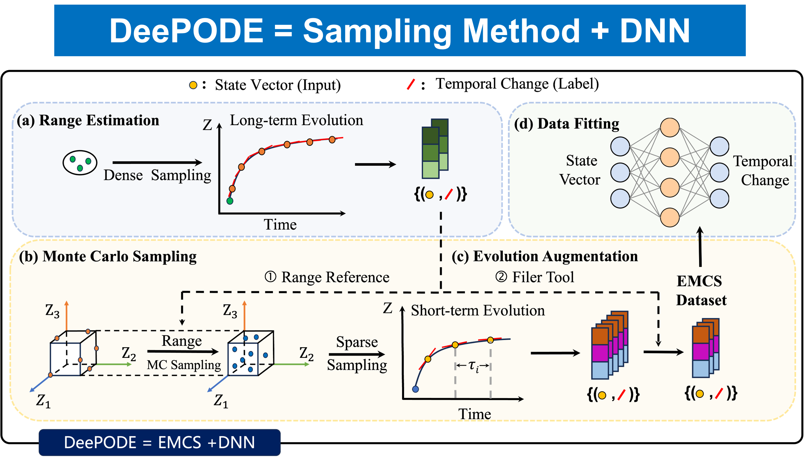
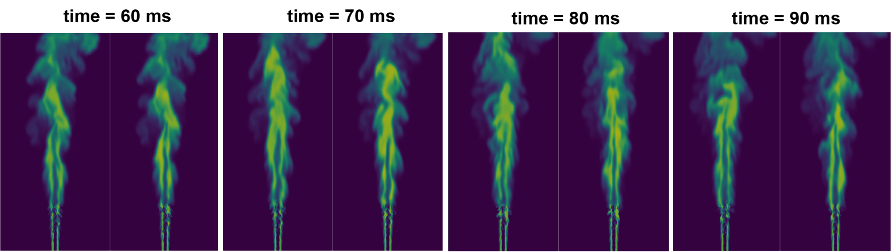
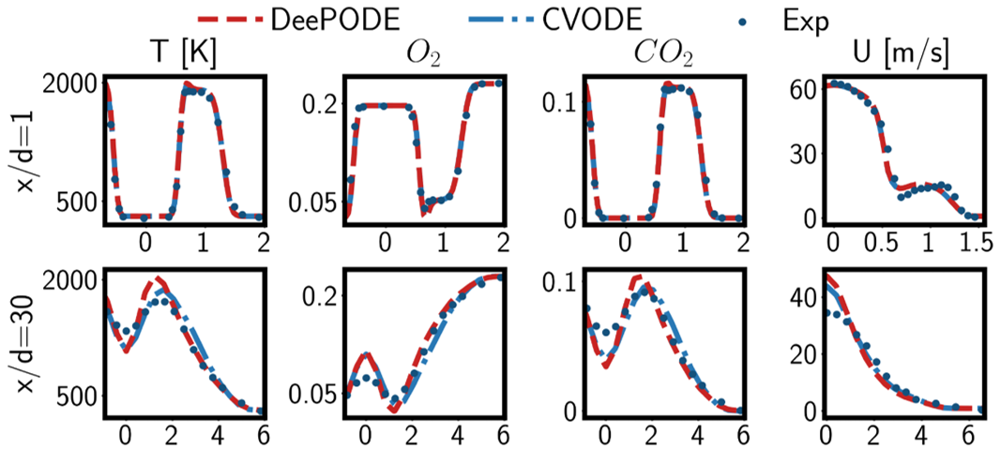
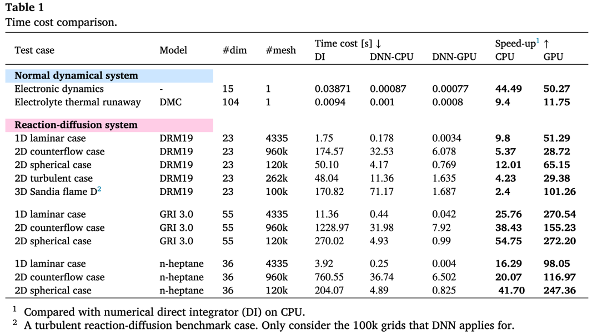
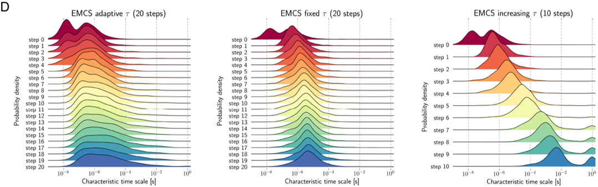

<div align="center">

<h2>
DeePODE: Solving Multiscale Dynamical Systems by Deep Learning
</h2>

<p align="center">
  <a href="https://doi.org/10.1016/j.cpc.2025.109802"></a>
  <a href="https://arxiv.org/abs/2401.01220"></a>
  <a href="LICENSE"></a>
  <a href="#"></a>
  <a href="#"></a>
</p>

<p align="center">
  
  
  

</p>


<p align="center">
  <strong>Fast, Accurate, and Generalizable Solver for High-Dimensional Stiff ODEs</strong>
</p>


<p align="center">
  <a href="https://doi.org/10.1016/j.cpc.2025.109802"><strong>[Paper]</strong></a> |
  <a href="https://arxiv.org/abs/2401.01220"><strong>[ArXiv]</strong></a> |
  <a href="https://ins.sjtu.edu.cn/people/xuzhiqin/pub/deepode2401.01220.pdf"><strong>[PDF]</strong></a> |
  <a href="#quick-start"><strong>[Quick Start]</strong></a>
</p>

</div>

-------

## 📣 Introduction

**DeePODE** is a novel deep learning framework designed to solve **high-dimensional multiscale dynamical systems**. These systems (e.g., chemical kinetics, power systems, biological networks) are traditionally modeled by stiff Ordinary Differential Equations (ODEs), which require extremely small time steps for numerical stability, leading to high computational costs.

DeePODE overcomes the **"Curse of Dimensionality"** and **stiffness constraints** by combining a specialized sampling strategy with an end-to-end Deep Neural Network (DNN).

### 🌟Features
- **🚀 Efficiency:** Achieves **10x–100x speedup** compared to traditional implicit solvers (e.g., CVODE) while maintaining comparable accuracy.
- **🎯 Precision:** Capable of capturing **multiscale dynamics** spanning orders of magnitude (from $10^{-9}s$ to $1s$).
- **🧩 Generalization:** A "Train Once, Use Anywhere" paradigm. A trained DeePODE model can be seamlessly integrated into 0D, 1D, 2D, and 3D simulations without retraining.


## 🛠️ Method

The core innovation of DeePODE is the **Evolutionary Monte Carlo Sampling (EMCS)** method, which generates high-quality training data to enable the DNN to learn the "local dynamical behavior" of the system.

### The Framework: EMCS + DNN
The method consists of three phases (as shown in Figure 1 of the paper):

1.  **Range Estimation:** Determines the feasible phase space boundaries using a small set of long-term evolution trajectories.
2.  **Monte Carlo (MC) Sampling:** Addresses the *curse of dimensionality* by performing global sampling within the estimated hypercube.
3.  **Evolution Augmented Generation:** Evolves the MC samples along their local ODE trajectories using adaptive time steps. This captures the **frequency spectrum** from high to low frequencies, ensuring the DNN learns both fast and slow modes.

> **Note:** The trained DNN acts as a time-stepper, predicting the state change $x(t+\Delta t)$ from $x(t)$ with a large $\Delta t$, bypassing the stiffness limit of traditional explicit solvers.

<p align="center">
  
</p>


## 🏆 Results

We validated DeePODE across diverse fields ranging from ecology to complex turbulent combustion.

### 📊 Performance on Multiscale Systems
DeePODE demonstrates robust performance on:
* **Predator-Prey Model:** Accurately captures limit cycle oscillations where standard MC-trained networks fail.
* **Electronic Circuit (Ring Modulator):** Predicts high-frequency signals in a 15-dimensional non-autonomous system without error accumulation.
* **Battery Thermal Runaway:** Handles stiff chemical kinetics (104 dimensions) involving rapid temperature changes.

### 🔥 Combustion Simulation (Reaction-Diffusion)
DeePODE was integrated into CFD codes (EBI-DNS, OpenFOAM) for complex reactive flow simulations:
- **Accuracy:** Replicates flame structure and propagation speeds of detailed mechanisms (DRM19, GRI-3.0, n-heptane).
- **Stability:** Stable prediction in 2D/3D turbulent cases over long horizons.

<p align="center">
  
  
</p>


## ⚡ Efficiency

DeePODE significantly reduces computational time compared to Direct Integration (DI) using CVODE.

<p align="center">
    
</p>

> **Key Takeaway:** The speedup is particularly significant on GPU architectures for large-scale simulations (up to **270x**).


## 🔍 Analysis

### Characteristic Time & Error Propagation
* **Timescale Coverage:** Traditional Monte Carlo sampling fails to capture fast timescales (concentrated < $10^{-5}s$). EMCS, through evolution augmentation, effectively covers the full spectrum of characteristic timescales (verified via CSP analysis).
* **Error Control:** Unlike traditional explicit schemes where error explodes, DeePODE's error remains bounded. The "solver indicator" (based on probability density) can further filter out unreliable predictions.

<p align="center">
    
</p>


<a name="quick-start"></a>
## 🚀 Quick Start

### (option 1) Install via conda
```bash
conda install pytorch
conda install --channel cantera cantera==2.6.0 -y
conda install numpy matplotlib seaborn scikit-learn pandas -y
pip install easydict scienceplots meshio -i https://pypi.tuna.tsinghua.edu.cn/simple
conda install -c conda-forge mpi4py openmpi
```
### (option 2) Install via docker
```bash 
docker pull ckode/deepck:1.0.0_pytorch1.12_cuda11.3
```

##  ⚡ Inference with Our Checkpoints
DeepODE provides a comprehensive command-line interface for performing inference with pre-trained models, supporting temporal evolution simulation, one-step validation, and model export into torch scripts.

> **Note:** The trained DNN acts as a temporal advancer, predicting the state change $x(t+\Delta t)$ from $x(t)$ with a large $\Delta t$, bypassing the stiffness limit of traditional explicit solvers.

> **Note:** The chemical dataset is organized as $x(t) = [T, p , Yi]$ where $T$ is temperature, $p$ is pressure (atm) and $Y_i$ denotes the mass fraction of $i$-th species.


### Quick Dryrun
Load the model and perform a quick sanity check on a dummy vector:
```bash 
python pred.py dryrun --modelname "DRM19-test" --epoch 5000
```

### One-Step Prediction & Plotting
Perform single-step prediction on the manifold and generate scatter plots (Pred vs. Label):
```bash 
python pred.py onestep_plot \
    --epoch 5000 \
    --size_show 10000 \
    --show_temperature 1000,2500
```

### Temporal Evolution
Load the model to simulate the temporal evolution of chemical reactions (e.g., Temperature and Species trajectories) and compare them with Cantera baselines:
```bash 
python pred.py evolution \
    --modelname "DRM19-test-gbct" \
    --epoch 5000 \
    --temperature 1650 \
    --n_step 2000 \
    --reactor "constP"
```

### Export Model to TorchScript format
Convert the trained PyTorch model to TorchScript for deployment:
```bash 
python pred.py export \
    --modelname "DRM19-test-gbct" \
    --epoch 5000 
```


## 💥 Retrain Your DeepODE Model

DeepODE supports both Single-GPU and Distributed Data Parallel (DDP) training. The training script automatically handles dataset loading, model construction, and logging.

### Data Preparation
Ensure your input and label `.npy` files are prepared and the mechanism file path is correct before starting training. For chemical reaction, the datset is in the shape of $N\times (n_{s}+2)$, where $n_s$ is the total number of species. Each data is organized as $x(t) = [T,~p,~Yi]$.

### Single-GPU Training
Suitable for small-scale experiments or debugging:
```bash 
# Train on a single GPU (e.g., cuda:0)
python train.py \
    --device "cuda:0" \
    --delta_t 1e-6 \
    -note "DeepODE single GPU experiment"
```

### DDP Training
```bash 
# Distributed training on 8 GPUs
python train.py \
    -cuda 0,1,2,3,4,5,6,7 \
    -ddp \
    --delta_t 1e-6 \
    -note "DeepODE DDP training benchmark"
```


## 📚 Citation


### Current Paper

```bibtex
@article{yao2025CPC,
  title = {Solving Multiscale Dynamical Systems by Deep Learning},
  author = {Yao, Junjie and Yi, Yuxiao and Hang, Liangkai and E, Weinan and Wang, Weizong and Zhang, Yaoyu and Zhang, Tianhan and Xu, Zhi-Qin John},
  year = {2025},
  journal = {Computer Physics Communications},
  volume = {316},
  pages = {109802},
  issn = {0010-4655},
  doi = {10.1016/j.cpc.2025.109802},
  langid = {english}
}
```

<details>
  <summary><strong>Other related works</strong>
  </summary>


```bibtex
@article{zhang2025AJ,
  title = {Deep Neural Networks for Modeling Astrophysical Nuclear Reacting Flows},
  author = {Zhang, Xiaoyu and Yi, Yuxiao and Wang, Lile and Xu, Zhi-Qin John and Zhang, Tianhan and Zhou, Yao},
  year = {2025},
  month = sep,
  journal = {Astrophysical Journal},
  volume = {990},
  number = {2},
  pages = {105},
  publisher = {The American Astronomical Society},
  doi = {10.3847/1538-4357/adf331},
  langid = {english}
}

@article{wang2025CF,
  title = {Enforcing Physical Conservation in Neural Network Surrogate Models for Complex Chemical Kinetics},
  author = {Wang, Tinghao and Yi, Yuxiao and Yao, Junjie and Xu, Zhi-Qin John and Zhang, Tianhan and Chen, Zheng},
  year = {2025},
  month = may,
  journal = {Combustion and Flame},
  volume = {275},
  pages = {114105},
  issn = {00102180},
  doi = {10.1016/j.combustflame.2025.114105},
  urldate = {2025-03-14},
  langid = {english}
}

@article{zhang2022CF,
  title = {A Multi-Scale Sampling Method for Accurate and Robust Deep Neural Network to Predict Combustion Chemical Kinetics},
  author = {Zhang, Tianhan and Yi, Yuxiao and Xu, Yifan and Chen, Zhi X. and Zhang, Yaoyu and E, Weinan and Xu, Zhi-Qin John},
  year = {2022},
  month = nov,
  journal = {Combustion and Flame},
  volume = {245},
  pages = {112319},
  issn = {00102180},
  doi = {10.1016/j.combustflame.2022.112319},
  urldate = {2024-12-08},
  langid = {english}
}

```

</details>

